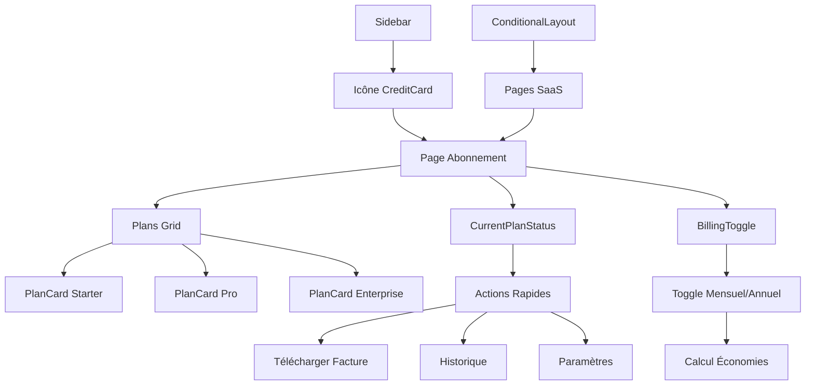

# Architecture de la Rubrique Abonnement

## Vue d'ensemble

La nouvelle rubrique "Abonnement" a été intégrée dans l'application MaydAI avec un design moderne et responsive. Elle permet aux utilisateurs de gérer leurs abonnements et de choisir entre différents plans tarifaires.

## Structure des Fichiers

```
app/abonnement/
├── page.tsx                    # Page principale d'abonnement
components/
├── PlanCard.tsx               # Composant pour les cartes de plans
├── CurrentPlanStatus.tsx      # Composant pour le statut du plan actuel
├── BillingToggle.tsx          # Composant pour basculer mensuel/annuel
├── Sidebar.tsx                # Navigation mise à jour avec l'icône Abonnement
└── ConditionalLayout.tsx      # Layout conditionnel mis à jour
```

## Fonctionnalités Implémentées

### 1. Page d'Abonnement (`/abonnement`)
- **Design responsive** : Adapté pour mobile, tablette et desktop
- **Trois plans tarifaires** : Starter, Pro, Enterprise
- **Basculement mensuel/annuel** : Avec économies affichées
- **Statut du plan actuel** : Informations de facturation
- **FAQ intégrée** : Questions fréquentes
- **CTA d'essai gratuit** : Appel à l'action

### 2. Composants Réutilisables

#### PlanCard
- Affichage des plans avec icônes colorées
- Calcul automatique des économies annuelles
- Badge "Le plus populaire" pour le plan Pro
- Boutons d'action contextuels

#### CurrentPlanStatus
- Informations du plan actuel
- Prochaine date de facturation
- Actions rapides (télécharger facture, historique, paramètres)

#### BillingToggle
- Basculeur mensuel/annuel
- Indicateur d'économies
- Design cohérent avec l'application

### 3. Intégration Navigation
- **Sidebar** : Nouvelle icône CreditCard pour "Abonnement"
- **Layout conditionnel** : Page incluse dans les pages SaaS
- **Routing** : Accessible via `/abonnement`

## Plans Tarifaires

### Starter (29€/mois ou 290€/an)
- Jusqu'à 5 cas d'usage IA
- Audit de conformité basique
- Rapports PDF standard
- Support par email

### Pro (79€/mois ou 790€/an) - **Le plus populaire**
- Jusqu'à 25 cas d'usage IA
- Audit de conformité avancé
- Rapports PDF personnalisés
- Support prioritaire
- Formations en ligne
- Intégrations API

### Enterprise (199€/mois ou 1990€/an)
- Cas d'usage IA illimités
- Audit de conformité expert
- Support dédié 24/7
- Formation personnalisée
- Gestion multi-utilisateurs
- SLA garantie

## Design et UX

### Couleurs et Thème
- **Couleur principale** : #0080A3 (bleu MaydAI)
- **Plans** : Bleu (Starter), Violet (Pro), Or (Enterprise)
- **États** : Vert (succès), Rouge (erreur), Jaune (attention)

### Responsive Design
- **Mobile** : Layout en colonne unique
- **Tablette** : Grille 2 colonnes pour les plans
- **Desktop** : Grille 3 colonnes complète

### Interactions
- **Hover effects** : Sur les cartes et boutons
- **Transitions** : Animations fluides
- **États visuels** : Plan actuel mis en évidence

## Architecture Technique



## Sécurité et Conformité

- **Authentification** : Page protégée par le système d'auth existant
- **Types TypeScript** : Typage strict pour tous les composants
- **Validation** : Vérification des états et transitions
- **Accessibilité** : Labels et navigation clavier

## Prochaines Étapes

1. **Intégration API** : Connexion avec le système de facturation
2. **Gestion des paiements** : Intégration Stripe/PayPal
3. **Notifications** : Alertes de facturation et changements
4. **Analytics** : Suivi des conversions et utilisations
5. **Tests** : Tests unitaires et d'intégration

## Maintenance

- **Composants modulaires** : Facilement réutilisables
- **Styles cohérents** : Utilisation de Tailwind CSS
- **Code propre** : Séparation des responsabilités
- **Documentation** : Commentaires et types explicites
